# Краткое введение в Git (3 сценария использования)

## Небольшое введение

**Git** (*гит*) является наиболее популярной разновидностью *системы управления версиями* (VCS). В настоящее время это необходимый инструмент профессиональной разработки ПО, используемый в подавляющем большинстве программных проектов. В рамках нашего учебного курса **Git** используется для контроля и отчетности выполнения практических заданий по программированию.

**Git** существует в качестве *сервера* и в качестве *клиента*. Далее, мы рассмотрим установку программы в качестве клиентского приложения на локальный компьютер пользователя. В качестве серверной части будет выступать известный ресурс [https://github.com](github.com).

**Git** - это свободно распространяемая программа и существует для множества операционных систем. Следующий раздел документа посвящен установке и настройке программы в ОС **Windows**.

## Установка и настройка

Переходим по адресу  [http://git-scm.com](http://git-scm.com) 


и выбираем дистрибутив для своеё операционной системы или идем по ссылке в нижнем правом углу страницы.


После скачивания и запуска инсталлятора появляется мастер установки:


*Git* - программа, распространяющаяся по лицензии GPL, допускающая свободное копирование и распространение:


В окне опций соглагшаемся с предложением по-умолчанию:


**Git** можно использовать через специальные программы-клиенты с графическим интерфейсом пользователя, а можно через обычную командную строку. Для изучения системы рекомендуется научиться основным командам, поэтому далее рассматривается работа именно в командной строке.

Инсталлятор установит специальную *unix*-подобную оболочку для ввода команд, под названием **Git Bash**:


На этом этапе установки вновь соглашаемся с инсталлятором:


Обратите внимание, что при выборе опций была установлена галочка в пункте *Интеграция с проводником Windows*. Тогда, в контекстном меню, вызываемом нажатием правой кнопкой мыши на области окна с папкой, должны появиться пункты:

- Git Bash Here
- Git GUI Here

что значительно облегчает запуск командной оболочки с переходом в указанную папку.

Теперь в проводнике Windows на диске C: создадим папку с будущим **репозиторием** (хранилищем) проектов. На самом деле эту папку можно размещать в любом месте файловой системы, но мы упрощаем себе задачу. **Внимание!** *Не рекомендуется хранить репозитории в папках с пробелами или кириллическими символами в названии.*


Если войти в проводнике в соданную папку (*C:\Labs*), вызвать контекстное меню и выбрать пункт **Git Bash Here**, то откроется окно оболочки с приглашением.

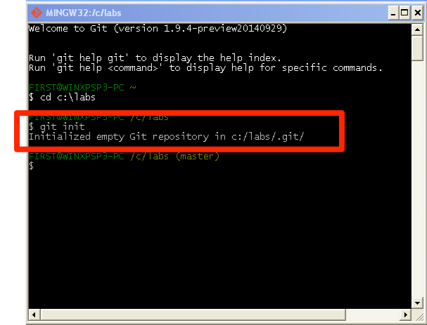

В окно теперь можно вводить команды для работы с **Git**. 

## Настройка пользователя и почты

Во время одного из этапов первоначальных действий с Git придётся настроить имя пользователя и адрес почты:

Предположим, что имя пользователя **Vasya Belov**, а почта - **vasya@mail.ru**


```
  git config --global user.name "Vasya Belov"
  git config --global user.email vasya@mail.ru
```

## Первый сценарий. Разработка собственного проекта

В каталоге `c:\labs` мы создадим свой учебный проект `Hello, World!` и пройдем через все этапы работы в **Git**.

Создадим папку `Hello` в каталоге `c:\labs` и перейдем туда в оболочке:

```
mkdir Hello
cd Hello
```

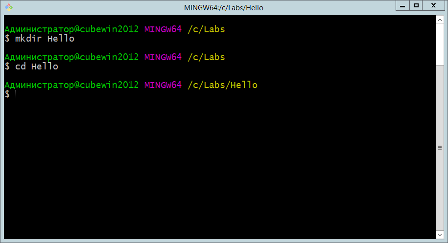


Создадим новый (пустой) репозиторий:

```
git init
```

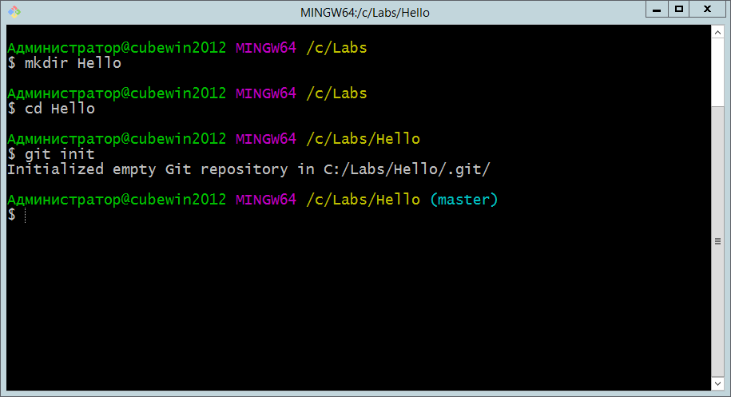

Создание нового репозитория предполагает появление в каталоге `Hello` скрытой папки с именем `.git`, в которой будут храниться все служебные файлы хранилища. В оболочке появляется надпись **master**, которая означает появление главной (и пока единственной) ветки репозитория.

Далее, создадим файл-исходник `hello.c` с текстом программы на языке C для нашего проекта:

```c
#include <stdio.h>

int main()
{
   printf("Hello, world!\n");
   return 0;
}
```

Файл можно создать в любом подходящем текстовом редакторе (**notepad**), но лучше использовать специальные редакторы для программистов (**notepad++**).

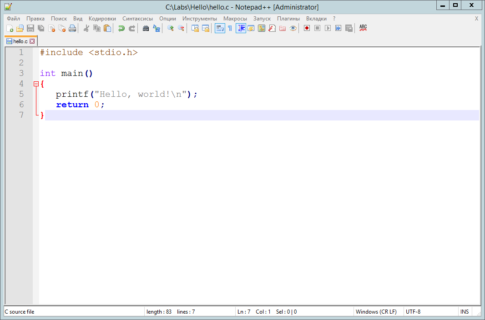

Команда 

```
git status
```

позволяет увидеть имя файла с программой, выделенное красным цветом. Git обнаружил в папке файл, но не включил его в свой индекс.

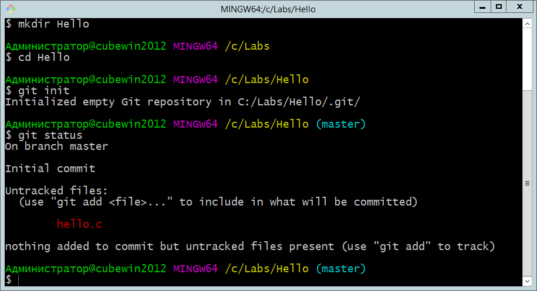

Добавим этот файл (а точнее: изменения в этом файле) к **git**:

```
git add hello.c
```

Команда проверки статуса покажет имя добавленного файла зеленым цветом.

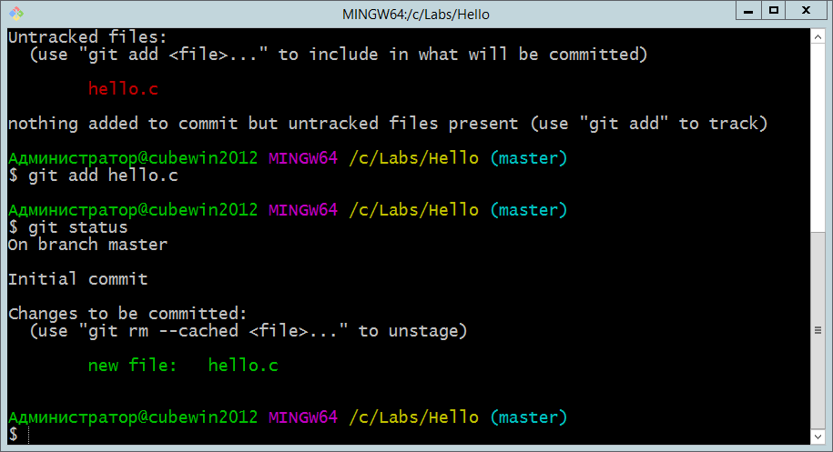

Теперь зафиксируем изменения:

```
git commit -m "Initial commit"
```

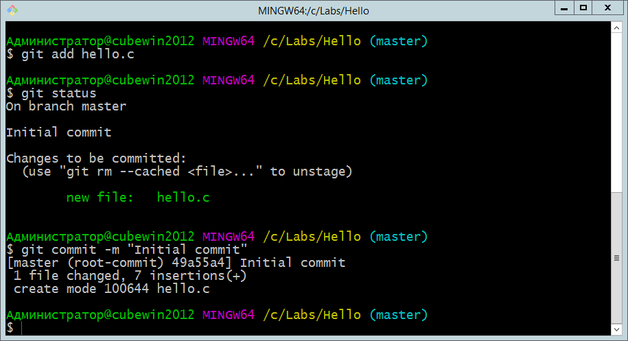

У нас появился первый коммит - элемент истории разработки. В дальнейшем на него можно ссылаться по семи первым символам хеш-кода (**49a55a4**).

Разработка программы предполагает внесение изменений в исходный код. После некоторого количества правок, когда очередной элемент программы завершен, файл сохранен, необходимо снова дать последовательность команд: 

```
git add hello.c
git commit -m "..."
```

Комментарий к коммиту должен отражать суть сделанных правок, быть лаконичным, но понятным.

Рассмотрим теперь более подробно рабочий процесс.

Когда мы меняем (или создаем) файлы, то они размещаются в рабочем каталоге (**working directory**). Команда **git add** добавляет сделанные изменения в область подготовки (**staging area**). При вызове  
 **git commit** происходит фиксация изменений в репозитории. В истории разработки появляется точка, на которую можно ссылаться, к которой можно совершать откат и т.п.


В таком виде процесс разработки может продолжаться сколько угодно, но рано или поздно потребуется отправить изменения на сервер, где проект может быть использован другими разработчиками.

## Первый сценарий. Работа с сервером

Для работы с серверной частью необходимо зарегистрироваться на [https://github.com](github.com). Обратите, пожалуйста внимание, что пользователям можно указывать тарифные планы для использования ресурса, но мы выбираем *бесплатный* тариф.

Активирование аккаунта происходит после подтверждающего письма по электронной почте.

Далее, мы выбираем вкладку **Repositories** и нажимаем зеленую кнопку **New**:

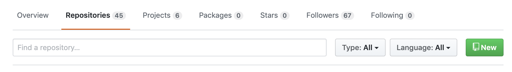

После этого необходимо заполнить ряд полей.

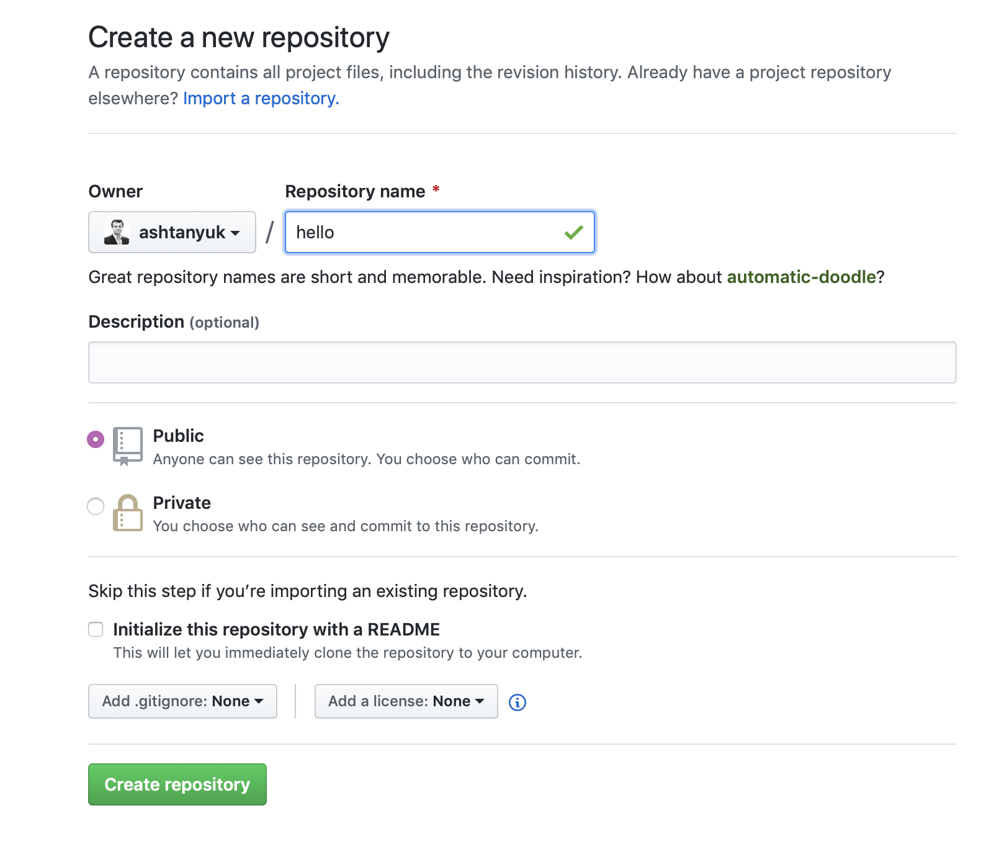

Нужно ввести имя создаваемого репозитория (лучше, если оно будет совпадать с локальным именем). Тип репозитория надо оставить **public** для свободно распространяемых проектов и **private** для закрытых от внешнего мира.

Нажатие зеленой кнопки **Create** переносит к финальному шагу:

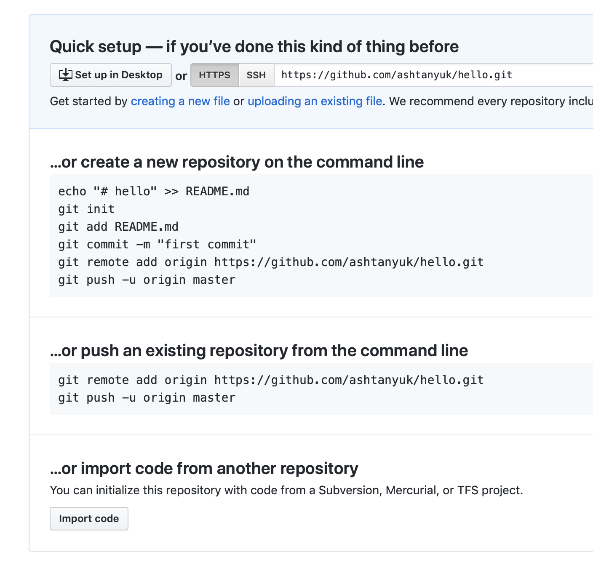

На последнем шаге нам предлагают связать локальный и удаленный репозитории командой **git remote**. Мы должны набрать в командной оболочке

```
git remote add origin https://github.com/имя_пользователя/hello.git
```

и передать первый раз изменения на сервер:

```
git push -u origin master
```

Слово **origin** в данном случае означает псевдоним серверного репозитория, а **master** имя ветки. По сути мы связали локальную и удаленную ветки **master** и отправили изменения на сервер.

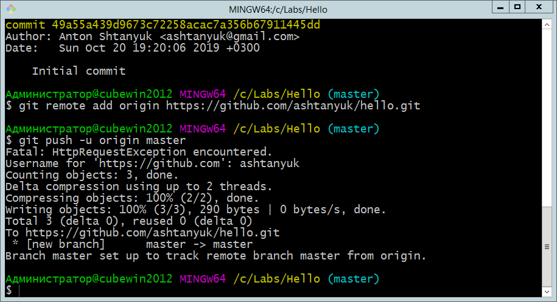

Страницу репозитория можно обновить

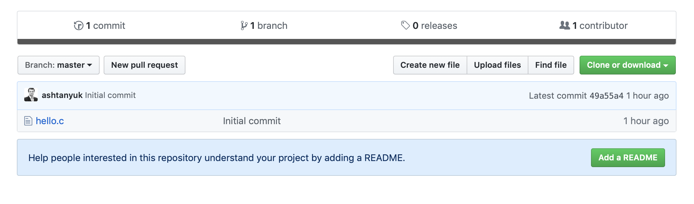

Как в дальнейшем отправлять обновления на сервер?

Как только на локальной машине накапливается достаточно изменений (новых коммитов), осуществляется их передача на удаленный сервер командой

```
git push
```

Эта команда передает изменения из текущей ветки в удаленную. В процессе установления соединения, возможно, потребуется указать свои регистрационные данные для аккаунта **Github**.

## Сценарий второй. Подключение еще одного локального компьютера для разработки

Рассмотрим теперь ситуацию, когда нам нужно подключить к удаленному серверу еще один компьютер, чтобы вести на нем разработку, параллельно другому. Или мы хотим, чтобы другие пользователи могли скачивать обновления нашего кода и пользоваться наше программой.

Любой пользователь **Github** может выполнить *клонирование* существующего **public** репозитория к себе на локальный компьютер.

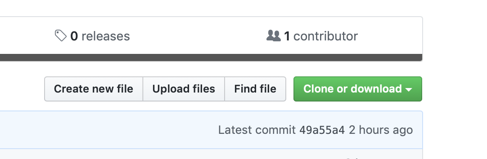

Если раскрыть список в виде зеленой кнопки, то мы увидим две возможности:

- клонировать репозиторий
- загрузить архив с файлами репозитория

В чем разница?

