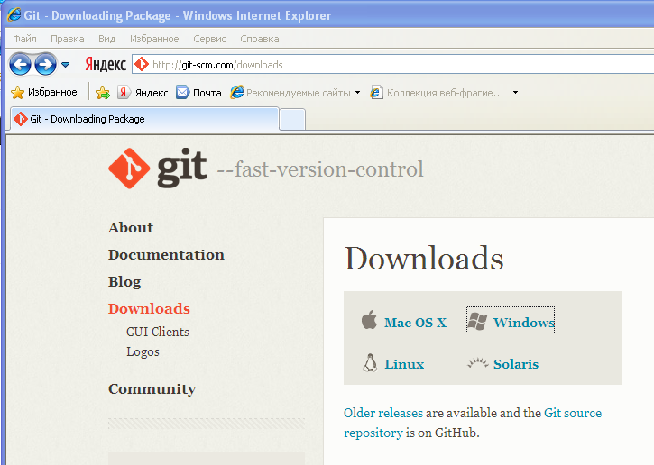
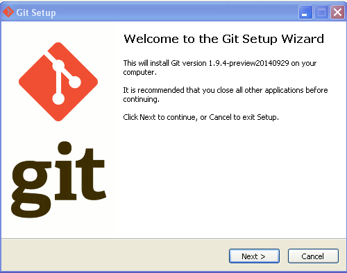
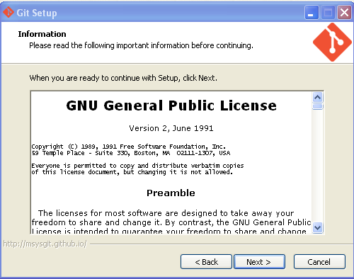
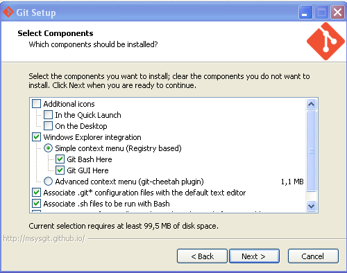
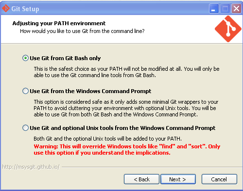
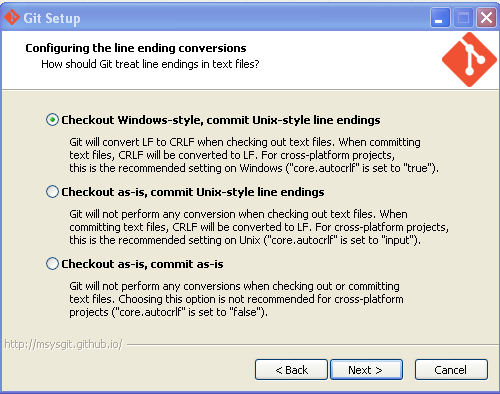
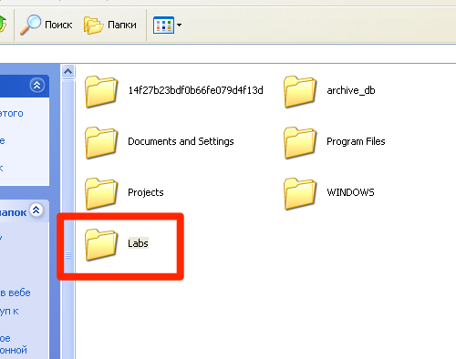
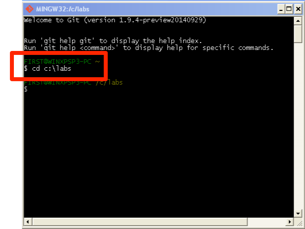

# Краткое введение в Git (3 сценария использования)

## Установка и настройка

Переходим по адресу  [http://git-scm.com](http://git-scm.com) 


и выбираем дистрибутив для своеё операционной системы.



После скачивания и запуска инсталлятора появляется мастер установки:



*Git* - программа, распространяющаяся по лицензии GPL, допускающая свободное копирование и распространение:



В окне опций соглагшаемся с предложением по-умолчанию:



Git можно использовать через специальные программы-клиенты с графическим интерфейсом пользователя, а можно через обычную командную строку. Для изучения системы рекомендуется научиться основным командам.

Инсталлятор установит специальную unix-подобную оболочку для ввода команд:



На этом этапе установки вновь соглашаемся с инсталлятором:



Теперь в проводнике Windows на диске C: создадим папку с будущим репозиторием (хранилищем) проектов. На самом деле эту папку можно размещать в любом месте файловой системы, но мы упрощаем себе задачу.



Запустим через главное меню системы оболочку **Git Bash** и дадим команду смены каталога внутри оболочки:



Разумеется, что при другом каталоге, нужно указать правильный адрес.

## Настройка пользователя и почты

Во время одного из этапов первоначальных действий с Git придётся настроить имя пользователя и адрес почты:


```
  git config --global user.name "John Doe"
  git config --global user.email johndoe@example.com
```

## Первый сценарий. Разработка собственного проекта.

В каталоге `c:\labs` мы создадим свой учебный проект `Hello, World!` и пройдем через все этапы работы в **Git**.

Создадим папку `Hello` в каталоге `c:\labs` и перейдем туда в оболочке:

```
mkdir Hello
cd Hello
```

Создадим новый (пустой) репозиторий:

```
git init
```

Создание нового репозитория предполагает появление в каталоге `Hello` скрытой папки с именем `.git`, в которой будут храниться все служебные файлы хранилища. В оболочке появляется надпись **master**, которая означает появление главной (и пока единственной) ветки репозитория.

Далее, создадим файл-исходник `hello.c` с текстом программы на языке C для нашего проекта:

```c
#include <stdio.h>

int main()
{
   printf("Hello, world!\n");
   return 0;
}
```

Команда 

```
git status
```

позволяет увидеть имя файла с программой, выделенное красным цветом. Git обнаружил в папке файл, но не включил его в свой индекс.

Добавим этот файл (а точнее: изменения в этом файле) к **git**:

```
git add hello.c
```

Команда проверки статуса покажет имя добавленного файла зеленым цветом.

Теперь зафиксируем изменения:

```
git commit -m "Initial commit"
```

У нас появился первый коммит - элемент истории разработки. В дальнейшем на него можно ссылаться по семи первым символам хеш-кода.


